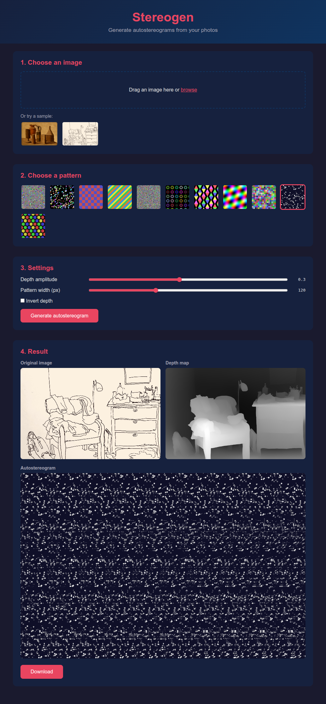

# Stereogen

Autostereogram generator from photos.

Upload an image, the server estimates the depth map with [Depth Anything V2](https://huggingface.co/depth-anything/Depth-Anything-V2-Base-hf), then the browser generates the autostereogram using a chosen pattern.



## Local setup

```bash
cd server
pip install -r requirements.txt
uvicorn main:app --reload
```

Open http://localhost:8000

The first launch downloads the model (~390 MB).

## Docker

```bash
docker build -t stereogen .
docker run -p 8000:8000 stereogen
```

## Architecture

```
stereogen/
├── server/
│   ├── main.py              # FastAPI, endpoint POST /api/depth
│   └── requirements.txt
├── frontend/
│   ├── index.html
│   ├── style.css
│   ├── app.js               # Stereogram algorithm (Thimbleby et al. 1994)
│   └── patterns/            # 10 tileable PNG patterns
└── Dockerfile
```

- **Backend**: FastAPI, Depth Anything V2 Base via Hugging Face `transformers`
- **Frontend**: Vanilla HTML/JS/Canvas, no framework
- **Algorithm**: Based on Thimbleby et al. 1994, processing from center outward

## Usage

1. Upload a photo
2. Choose a pattern
3. Adjust depth amplitude and pattern width
4. Generate and download the autostereogram

## Regenerate patterns

```bash
cd frontend/patterns
python generate_patterns.py
```

## Credits

- **Stereogram algorithm**: Based on [Thimbleby, Inglis, Witten — "Displaying 3D Images: Algorithms for Single-Image Random-Dot Stereograms" (1994)](https://www.cs.utexas.edu/~fussell/courses/cs354/assignments/raytracing/SIRDS-paper.pdf)
- **Depth estimation**: [Depth Anything V2](https://github.com/DepthAnything/Depth-Anything-V2) by Yang et al. (NeurIPS 2024)
- **Seamless tiling and row offset techniques**: Inspired by [DeepStereo](https://github.com/nicholasgasior/DeepStereo)
